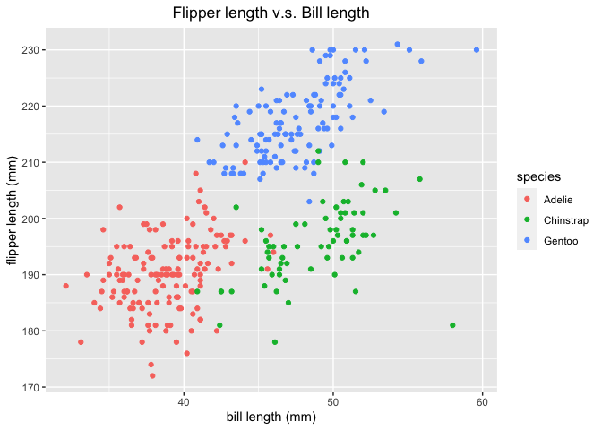

Homework 1
================
Beibei Cao
September 15, 2020

This is my solution to HW1.

``` r
library(tidyverse)
```

    ## ── Attaching packages ──────────────────────────────────────────────────── tidyverse 1.3.0 ──

    ## ✓ ggplot2 3.3.2     ✓ purrr   0.3.4
    ## ✓ tibble  3.0.3     ✓ dplyr   1.0.2
    ## ✓ tidyr   1.1.2     ✓ stringr 1.4.0
    ## ✓ readr   1.3.1     ✓ forcats 0.5.0

    ## ── Conflicts ─────────────────────────────────────────────────────── tidyverse_conflicts() ──
    ## x dplyr::filter() masks stats::filter()
    ## x dplyr::lag()    masks stats::lag()

## Problem 1

#### Create a data frame

``` r
prob1_df = 
  tibble(
    samp = rnorm(10),
    samp_gt_0 = samp > 0,
    char_vec = c("a", "b", "c", "d", "e", "f", "g", "h", "i", "j"),
    factor_vec = factor(c("low", "low", "low", "mod", "mod", "mod", "mod", "high", "high", "high"))
  )
```

#### Take the mean of each variable

``` r
mean(pull(prob1_df, samp))
## [1] -0.07518478
mean(pull(prob1_df, samp_gt_0))
## [1] 0.6
mean(pull(prob1_df, char_vec))
## Warning in mean.default(pull(prob1_df, char_vec)): argument is not numeric or
## logical: returning NA
## [1] NA
mean(pull(prob1_df, factor_vec))
## Warning in mean.default(pull(prob1_df, factor_vec)): argument is not numeric or
## logical: returning NA
## [1] NA
```

I can take the means of numbers and logical but not character or factor.

#### Use `as.numeric` function to convert variables

``` r
as.numeric(pull(prob1_df, samp))
##  [1] -0.8566581  1.1620176  0.4099954 -1.5291904  0.3302032  1.0816822
##  [7] -1.0585672  0.2710397  0.4074553 -0.9698255
as.numeric(pull(prob1_df, samp_gt_0))
##  [1] 0 1 1 0 1 1 0 1 1 0
as.numeric(pull(prob1_df, char_vec))
## Warning: NAs introduced by coercion
##  [1] NA NA NA NA NA NA NA NA NA NA
as.numeric(pull(prob1_df, factor_vec))
##  [1] 2 2 2 3 3 3 3 1 1 1
```

#### Convert variables

``` r
# Convert the logical vector to numeric, and multiply the random sample by the result.
as.numeric(pull(prob1_df, samp_gt_0)) * pull(prob1_df, samp)
##  [1] 0.0000000 1.1620176 0.4099954 0.0000000 0.3302032 1.0816822 0.0000000
##  [8] 0.2710397 0.4074553 0.0000000

# Convert the logical vector to a factor, and multiply the random sample by the result.
as.factor(pull(prob1_df, samp_gt_0)) * pull(prob1_df, samp)
## Warning in Ops.factor(as.factor(pull(prob1_df, samp_gt_0)), pull(prob1_df, : '*'
## not meaningful for factors
##  [1] NA NA NA NA NA NA NA NA NA NA

# Convert the logical vector to a factor and then convert the result to numeric, and multiply the random sample by the result
as.numeric(as.factor(pull(prob1_df, samp_gt_0))) * pull(prob1_df, samp)
##  [1] -0.8566581  2.3240351  0.8199907 -1.5291904  0.6604065  2.1633644
##  [7] -1.0585672  0.5420795  0.8149106 -0.9698255
```

#### why not `$`

``` r
prob1_df$samp
##  [1] -0.8566581  1.1620176  0.4099954 -1.5291904  0.3302032  1.0816822
##  [7] -1.0585672  0.2710397  0.4074553 -0.9698255

pull(prob1_df, samp)
##  [1] -0.8566581  1.1620176  0.4099954 -1.5291904  0.3302032  1.0816822
##  [7] -1.0585672  0.2710397  0.4074553 -0.9698255

prob1_df[["samp"]]
##  [1] -0.8566581  1.1620176  0.4099954 -1.5291904  0.3302032  1.0816822
##  [7] -1.0585672  0.2710397  0.4074553 -0.9698255
```

## Problem 2

##### Use the code below to download the package containing the `penguins` dataset:

``` r
install.packages("palmerpenguins")
```

##### Load the data and take a look:

``` r
data("penguins", package = "palmerpenguins")
head(penguins)
```

    ## # A tibble: 6 x 8
    ##   species island bill_length_mm bill_depth_mm flipper_length_… body_mass_g sex  
    ##   <fct>   <fct>           <dbl>         <dbl>            <int>       <int> <fct>
    ## 1 Adelie  Torge…           39.1          18.7              181        3750 male 
    ## 2 Adelie  Torge…           39.5          17.4              186        3800 fema…
    ## 3 Adelie  Torge…           40.3          18                195        3250 fema…
    ## 4 Adelie  Torge…           NA            NA                 NA          NA <NA> 
    ## 5 Adelie  Torge…           36.7          19.3              193        3450 fema…
    ## 6 Adelie  Torge…           39.3          20.6              190        3650 male 
    ## # … with 1 more variable: year <int>

##### Description:

The `penguins` data set includes the following variables: `species,
island, bill_length_mm, bill_depth_mm, flipper_length_mm, body_mass_g,
sex, year`; the species include `Adelie, Chinstrap, Gentoo`; the data
set has `344` rows and `8` columns. The mean of the flipper length is
`200.9152047` mm.

##### Make a scatterplot of `flipper_length_mm`(y) vs `bill_length_mm` (x); color points using the `species` variable.

``` r
ggplot(na.omit(penguins), aes(x = bill_length_mm, y = flipper_length_mm, color = species, )) + geom_point() + xlab("bill length (mm)") + ylab("flipper length (mm)") + ggtitle("Flipper length v.s. Bill length") + theme(plot.title = element_text(hjust = 0.5))
```

<!-- -->

``` r
# save the plot as pdf
ggsave("scatter_plot.pdf", height = 4, width = 4)
```
