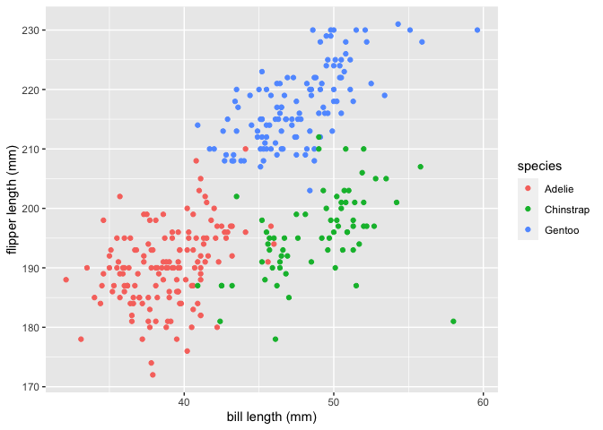

Homework 1
================
Beibei Cao

This is my solution to HW1.

``` r
library(tidyverse)
```

    ## ── Attaching packages ──────────────────────────────────────────────────── tidyverse 1.3.0 ──

    ## ✓ ggplot2 3.3.2     ✓ purrr   0.3.4
    ## ✓ tibble  3.0.3     ✓ dplyr   1.0.2
    ## ✓ tidyr   1.1.2     ✓ stringr 1.4.0
    ## ✓ readr   1.3.1     ✓ forcats 0.5.0

    ## ── Conflicts ─────────────────────────────────────────────────────── tidyverse_conflicts() ──
    ## x dplyr::filter() masks stats::filter()
    ## x dplyr::lag()    masks stats::lag()

## Problem 1

Create a data frame with the specified elements.

``` r
prob1_df = 
  tibble(
    samp = rnorm(10),
    samp_gt_0 = samp > 0,
    char_vec = c("a", "b", "c", "d", "e", "f", "g", "h", "i", "j"),
    factor_vec = factor(c("low", "low", "low", "mod", "mod", "mod", "mod", "high", "high", "high"))
  )
```

Take the mean of each variable in my data frame.

``` r
mean(pull(prob1_df, samp))
```

    ## [1] -0.09739341

``` r
mean(pull(prob1_df, samp_gt_0))
```

    ## [1] 0.5

``` r
mean(pull(prob1_df, char_vec))
```

    ## Warning in mean.default(pull(prob1_df, char_vec)): argument is not numeric or
    ## logical: returning NA

    ## [1] NA

``` r
mean(pull(prob1_df, factor_vec))
```

    ## Warning in mean.default(pull(prob1_df, factor_vec)): argument is not numeric or
    ## logical: returning NA

    ## [1] NA

I can take the means of numbers and logical but not character or factor.

Use `as.numeric` function to convert variables from one type to another.

``` r
as.numeric(pull(prob1_df, samp))
```

    ##  [1] -1.970008914 -0.008265302 -1.044531887  0.001412012  0.275316001
    ##  [6] -0.261934764 -0.161218711  1.297526027  0.788471036  0.109300390

``` r
as.numeric(pull(prob1_df, samp_gt_0))
```

    ##  [1] 0 0 0 1 1 0 0 1 1 1

``` r
as.numeric(pull(prob1_df, char_vec))
```

    ## Warning: NAs introduced by coercion

    ##  [1] NA NA NA NA NA NA NA NA NA NA

``` r
as.numeric(pull(prob1_df, factor_vec))
```

    ##  [1] 2 2 2 3 3 3 3 1 1 1

Convert the logical vector to numeric, and multiply the random sample by
the result.

``` r
as.numeric(pull(prob1_df, samp_gt_0)) * pull(prob1_df, samp)
```

    ##  [1] 0.000000000 0.000000000 0.000000000 0.001412012 0.275316001 0.000000000
    ##  [7] 0.000000000 1.297526027 0.788471036 0.109300390

Convert the logical vector to a factor, and multiply the random sample
by the result.

``` r
as.factor(pull(prob1_df, samp_gt_0)) * pull(prob1_df, samp)
```

    ## Warning in Ops.factor(as.factor(pull(prob1_df, samp_gt_0)), pull(prob1_df, : '*'
    ## not meaningful for factors

    ##  [1] NA NA NA NA NA NA NA NA NA NA

Convert the logical vector to a factor and then convert the result to
numeric, and multiply the random sample by the result

``` r
as.numeric(as.factor(pull(prob1_df, samp_gt_0))) * pull(prob1_df, samp)
```

    ##  [1] -1.970008914 -0.008265302 -1.044531887  0.002824023  0.550632003
    ##  [6] -0.261934764 -0.161218711  2.595052054  1.576942072  0.218600779

why not `$`

``` r
prob1_df$samp
```

    ##  [1] -1.970008914 -0.008265302 -1.044531887  0.001412012  0.275316001
    ##  [6] -0.261934764 -0.161218711  1.297526027  0.788471036  0.109300390

``` r
pull(prob1_df, samp)
```

    ##  [1] -1.970008914 -0.008265302 -1.044531887  0.001412012  0.275316001
    ##  [6] -0.261934764 -0.161218711  1.297526027  0.788471036  0.109300390

``` r
prob1_df[["samp"]]
```

    ##  [1] -1.970008914 -0.008265302 -1.044531887  0.001412012  0.275316001
    ##  [6] -0.261934764 -0.161218711  1.297526027  0.788471036  0.109300390

## Problem 2

Use the code below to download the package containing the `penguins`
dataset:

``` r
install.packages("palmerpenguins")
```

Load the data and take a look:

``` r
data("penguins", package = "palmerpenguins")
head(penguins)
```

    ## # A tibble: 6 x 8
    ##   species island bill_length_mm bill_depth_mm flipper_length_… body_mass_g sex  
    ##   <fct>   <fct>           <dbl>         <dbl>            <int>       <int> <fct>
    ## 1 Adelie  Torge…           39.1          18.7              181        3750 male 
    ## 2 Adelie  Torge…           39.5          17.4              186        3800 fema…
    ## 3 Adelie  Torge…           40.3          18                195        3250 fema…
    ## 4 Adelie  Torge…           NA            NA                 NA          NA <NA> 
    ## 5 Adelie  Torge…           36.7          19.3              193        3450 fema…
    ## 6 Adelie  Torge…           39.3          20.6              190        3650 male 
    ## # … with 1 more variable: year <int>

Description: the `penguins` dataset includes the following variables:
`species, island, bill_length_mm, bill_depth_mm, flipper_length_mm,
body_mass_g, sex, year`; it has `344` rows and `8` columns. The mean of
the flipper length is 200.9152047.

Make a scatterplot of `flipper_length_mm`(y) vs `bill_length_mm` (x);
color points using the `species` variable.

``` r
ggplot(na.omit(penguins), aes(x = bill_length_mm, y = flipper_length_mm, color = species)) + geom_point() + xlab("bill length (mm)") + ylab("flipper length (mm)")
```

<!-- -->

``` r
ggsave("scatter_plot.pdf", height = 4, width = 4)
```
